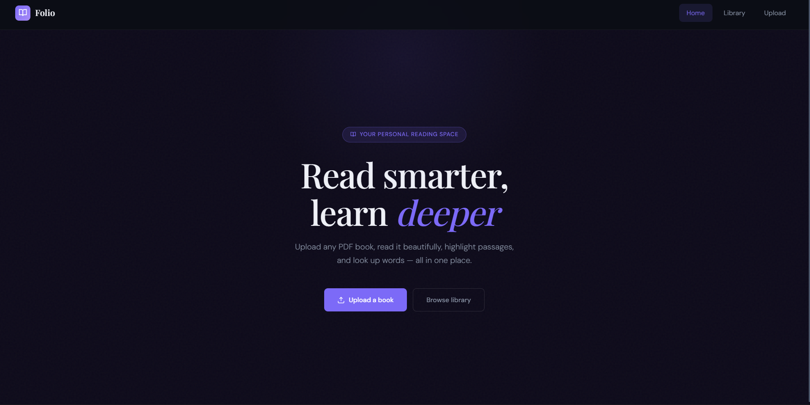
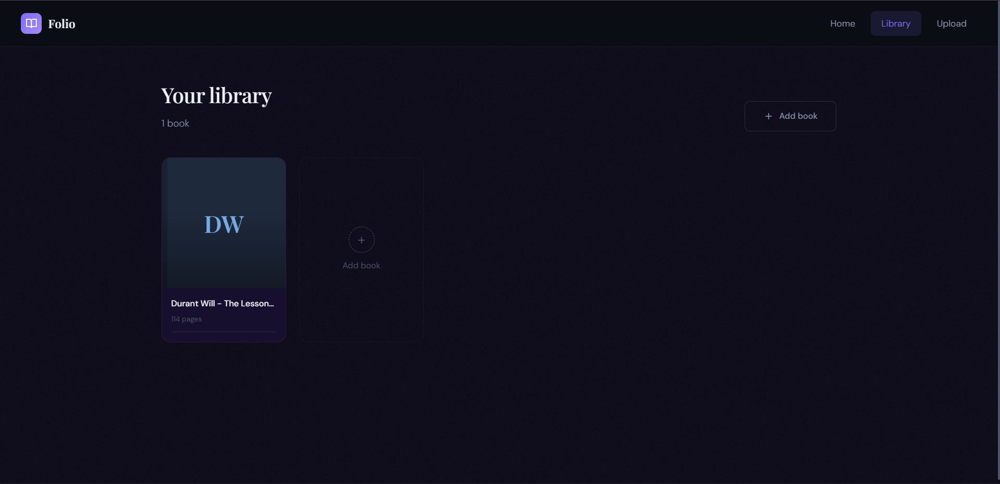
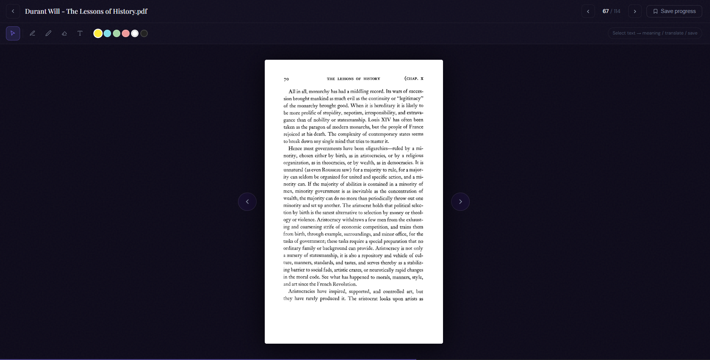

# 📚 Folio – Smart PDF Reader

Folio is an interactive, modern PDF reader web application that goes beyond basic reading. It allows users to **annotate, highlight, translate, and understand content deeply** while maintaining a smooth and elegant reading experience.

---

## ✨ Features

### 📖 Core Reading

* Smooth PDF rendering using **PDF.js**
* Page navigation (buttons + keyboard + click navigation)
* Progress tracking with visual indicator

### 🖊️ Annotation Tools

* Highlight important text
* Freehand drawing (pen tool)
* Eraser for removing annotations
* Draggable and resizable **text boxes**

### 🧠 Smart Learning Features

* Select text inside annotations
* Get **word meanings** (Dictionary API)
* Translate words into multiple languages (Hindi, Spanish, French, etc.)
* Save important words to personal notes

### 🔖 Persistence & State

* Resume reading from last saved page
* Save words with definitions
* Supabase integration for backend storage

---

## 🛠️ Tech Stack

* **Frontend:** React 18 + Vite
* **Styling:** Custom CSS (Dark UI system)
* **PDF Rendering:** pdfjs-dist (PDF.js)
* **Backend:** Supabase (Database + Storage)
* **Routing:** React Router

---

## 🧩 Architecture Overview

Folio uses a layered approach:

* **PDF Canvas Layer** → renders document
* **Overlay Canvas Layer** → handles drawing tools
* **DOM Layer** → text annotations
* **UI Layer** → toolbar, panels, popups

This separation enables smooth interaction without affecting PDF rendering.

---

## 🚀 How to Run Locally

```bash
# Clone the repository
git clone https://github.com/your-username/folio.git

# Navigate to project
cd folio

# Install dependencies
npm install

# Start development server
npm run dev
```

---

## 🔐 Environment Variables

Create a `.env` file:

```env
VITE_SUPABASE_URL=your_project_url
VITE_SUPABASE_ANON_KEY=your_anon_key
```

---

## 📸 Screenshots

### 🏠 Home Page  
Elegant landing page with a clean dark theme and smooth typography  



---

### 📚 Library View  
Manage and browse your uploaded books with a minimal card layout  



---

### 📖 Reader Interface  
Immersive reading experience with annotation tools, page navigation, and progress tracking  




---

## ⚡ Challenges Solved

* Handling **canvas-based PDF rendering**
* Building an **annotation layer on top of static PDF**
* Managing multiple interaction layers (canvas + DOM)
* Implementing **real-time UI feedback (popup, panel, toast)**
* Integrating third-party APIs (dictionary + translation)

---

## 🔮 Future Improvements

* Save and reload drawing annotations
* Full text-layer support for PDF selection
* User authentication system
* Search inside PDF
* Bookmark management UI

---

## 👨‍💻 Author

**Tanishak Bansal**

---

## 🌟 Project Status

🚧 Actively improving – turning into a full-featured reading platform
